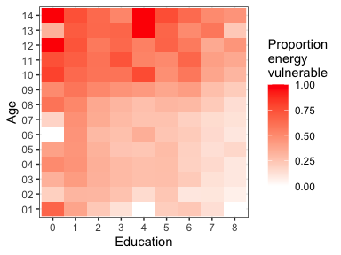

<!-- README.md is generated from README.Rmd. Please edit that file -->

# STA 199: Exam 01

## Instructions

The exam repository is available on the GitHub course organization page
with the prefix **exam\_01-**.

The exam questions are in the README portion of the repository.

### Deadline

This exam is due **Tuesday, February 23 at 11:59pm ET**.

You must submit a PDF document to Gradescope that corresponds to an
`.Rmd` file in your GitHub repository in order to receive credit for
this exam.

**There will be no grace period. Start and submit the exam early in
order to** **avoid any last-minute technical issues.**

**You may resubmit the exam before the deadline.**

If a PDF is not uploaded to Gradescope by the submission deadline, your
latest commit prior to the deadline will be used as your submission.
There will be a penalty for failing to submit a PDF to Gradescope.

Commit and push often and at appropriate times. Part of your grade will
be based on the quality of commit history.

### Rules

  - This is an individual assignment.
  - Everything in your repository is for your eyes only.
  - You may not collaborate or communicate anything about this exam to
    **anyone** except the instructor. For example, you may not
    communicate with other students, the TAs, or post/solicit help on
    the internet, email or via any other method of communication.
  - You may use `R`, as well as any notes, books, or existing internet
    resources to answer exam questions.
  - You must cite any code you use as inspiration. A failure to cite is
    plagiarism. Cite any sources by providing a link to the original
    source in your exam write-up.
  - No TA office hours will be held while the exam is live.
  - Do not email the TAs with questions.
  - If you have questions, contact the instructor. However, questions
    should only be about understanding the exam’s instructions. You may
    not ask questions on any topics from past assignments or material
    related to the exam.

### Academic Integrity

By taking this exam, you pledge to uphold the Duke Community Standard:

  - I will not lie, cheat, or steal in my academic endeavors;
  - I will conduct myself honorably in all my endeavors; and
  - I will act if the Standard is compromised.

### Submission

Please only upload your PDF document to Gradescope. Before you submit
the uploaded document, mark where each answer is to the exercises. If
any answer spans multiple pages, then mark all pages. Make sure to
associate the “Overall” section with the first page. **Failure to do so
may result in points** **being taken off.**

Make sure that your uploaded PDF document matches your `.Rmd` and the
PDF in your repository exactly. Points will be deducted for
non-reproducibility.

## Introduction

Millions of Americans have experienced record cold temperatures this
past week as a polar vortex has brought snow, ice, and bitter cold down
from America’s neighbor to the North. While atypical for many Americans,
this sort of weather is common in Canada. Persistent cold weather leads
to high heating bills, and Canadians with low incomes may not have the
resources necessary to keep their homes warm.

This exam will investigate the energy vulnerability of Canadians based
on a random sample of Canadians in the Survey of Household Spending. The
data is provided in the `canada_survey.rds` file in the `data/` folder.
Descriptions of the variables in the dataset can be found in
`data_dictionary.pdf` in folder `data/`.

## Packages

You’ll need the following R package for this exam. This is included in
`exam_01.Rmd`.

``` r
library(tidyverse)
```

## Data

To get started, read in the data. This code is provided in your
`exam_01.Rmd` file.

``` r
cas <- read_rds("data/canada_survey.rds")
```

## Tasks

You must use `tidyverse` code and style. All visualizations should
implement best practices as discussed in lecture. You do not need to
print out your tibble result unless a task asks you to do so.

As a warning, this data may not be free from error. Use your best
judgment on how to deal with the data if you come across obvious
mistakes.

#### Task 1

Data cleaning:

  - Subset `cas` so that variables `energy_expense` and
    `household_income` only contain values greater than 0. Overwrite
    `cas`.

  - Use function `factor()` to change the variable `marital_status` to
    be a factor rather than double. Overwrite `cas`. Consult the data
    dictionary and write-out what the marital status codes mean.

#### Task 2

Use function `case_when()` from `dplyr` to recode the two variables
below. Overwrite `cas` after each recoding. Do not use function
`if_else()` to complete this task.

Here is a small example of `case_when()` in action. Consult R’s help for
further examples.

``` r
data <- tibble(
  name = c("Bob", "Jacob", "Shawn", "Frances"),
  operating_system = c(0, 1, 0, 2)
)
data
#> # A tibble: 4 x 2
#>   name    operating_system
#>   <chr>              <dbl>
#> 1 Bob                    0
#> 2 Jacob                  1
#> 3 Shawn                  0
#> 4 Frances                2

data %>% 
  mutate(operating_system = case_when(
    operating_system == 0 ~ "Mac",
    operating_system == 1 ~ "Windows",
    operating_system == 2 ~ "Linux"
  ))
#> # A tibble: 4 x 2
#>   name    operating_system
#>   <chr>   <chr>           
#> 1 Bob     Mac             
#> 2 Jacob   Windows         
#> 3 Shawn   Mac             
#> 4 Frances Linux
```

Recode `heat_equip` so instead of having values 1, 2, 3, 4, it contains
values `"steam"`, `"forced air"`, `"stove"`, and `"electric heating"`
according to the data dictionary. These new values are as defined below:

  - `steam`: steam or water furnace
  - `forced air`: forced air furnace
  - `stove`: heating stoves, cookstove, or other
  - `electric heating`: electric

Recode `heat_fuel` so instead of having values 1, 2, 3, 4, it contains
values `"oil"`, `"gas"`, `"electricity"`, and `"other"` according to the
data dictionary. These new values are as defined below:

  - `oil`: oil or other liquid fuel
  - `gas`: natural gas
  - `electricity`: electricity
  - `other`: bottled gas, wood, or other

#### Task 3

For each combination of heating fuel type and heating equipment, find
the mean, median, and standard deviation of household energy
expenditures. Print your results.

Based on your findings, answer the following questions in 1 - 2
sentences total.

  - What combination of fuel type and equipment has the highest average
    energy expense?

  - Which combination has the most variability with regards to energy
    expense?

  - Which type of heating equipment doesn’t take all possible fuel
    types?

#### Task 4

Create side-by-side boxplots of energy expenses by heating fuel type and
faceted by the type of heating equipment in a 2 x 2 grid. Your axis
should be appropriately labeled with a dollar sign and commas. The
`scales` package may be helpful here.

#### Task 5

Using a single code pipeline, create a new variable describing the
proportion of household income spent on energy related expenses, and
then find the respondent that spent the highest proportion of their
household income on energy and the respondent that spent the lowest
proportion of their household income on energy. End your pipeline with
the tibble being passed into `glimpse()`. Describe these respondents
based on the data they have provided.

#### Task 6

For each year, find the province with the cheapest median energy expense
per room. Your answer should consist of a single `dplyr` pipeline that
results in two rows and three columns – `year`, `province`, and
`median_energy_expense_per_room`.

#### Task 7

A respondent is considered to be “energy vulnerable” if they spend more
than 5% of their household income on energy expenses. Recreate the plot
below, which shows the proportion of respondents who are energy
vulnerable for each combination of age and education. In 2 - 3
sentences, describe what you observe in the plot.

*Hints:*

  - use `geom_raster()`
  - colors are from `"white"` to `"red"` in `scale_fill_gradient()`
  - theme is `bw`
  - figure width is 7, figure height is 6



#### Task 8

Examine the `cas` data and think of an interesting research question you
can ask. Then, create one or two effective visualizations and/or
numerical summaries to help answer your question. Use your visuals and
summaries to derive insights about the population of Canadian
households.

Write a brief 1 - 2 paragraph report that ties together your research
question, visualizations, and conclusions in a cohesive, well-written
data narrative. Your research question should be substantially different
from the questions investigated above. There are still a lot of
variables you haven’t explored that exist in `cas`.

Only exceptional analyses that go above and beyond will receive full
credit. Mistake-free analyses will earn most, but not all points.
**There is no single correct answer for these data.** Be creative and
have fun\!
